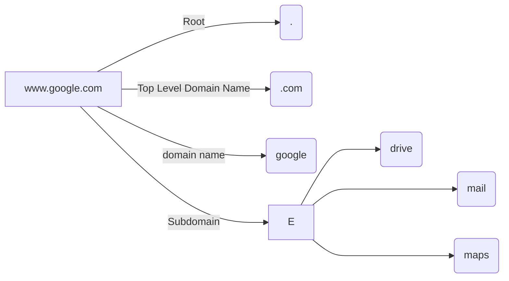

# Linux Basics

**Linux CLI**
**Vi Editor** 
**Package Management** 
**Service Management** 

# Linux CLI

This is a command line interface for writing linux commands.
**Linux Shell**: A text based cli that helps run commands to interact with the operating system.

## Shell Types
**Bourne Shell**< sh shell> 
**C Shell**< csh or tcsh>
**Z Shell**< zsh>
**Bourne again Shell**< bash>

## Some Linux commands

    echo $SHELL - check the shell you are currently using
    echo Hi - print to screen
    ls - list files and folders
    cd my_dir1 - change directory
    pwd - present working directory
    mkdir new_directory - make Directory
    cd new_directory; mkdir www; pwd - multiple commands
    mkdir –p /tmp/asia/india/bangalore - make directory hierachy
    rm –r /tmp/my_dir1 - remove Directory
    cp –r my_dir1 /tmp/my_dir1 - copy Directory
    touch new_file.txt - create a new file (no contents)
    cat > new_file.txt - add contents to file
    cat new_file.txt - view contents of file
    cp new_file.txt copy_file.txt - copy File
    mv new_file.txt sample_file.txt - move (rename) File
    rm new_file.txt - remove (Delete) File

## User Accounts
Every linux system has a super user who is known as the rot user which can perform any task.
Root users can grant normal users access to root files/credentials

    whoami - checks user
    id - checks user id
    su username
    ssh username@192.168.1.2
    ls /root
    sudo ls /root
    
**Commands to Download Files**

    curl http://www.some-site.com/some-file.txt -O
    wget http://www.some-site.com/some-file.txt -O some-file.txt
    
**Commands to Check OS Version**

    ls /etc/*release*
    cat /etc/*release*

# Package Manager
They help istall many packages on the linux systems.
**CentOS** uses RPM < RedHat Package Manager>
**YUM** is a high level package manager that uses rpm underneath, it also helps install all dependecies associated with a package
**Every OS comes installed with its own repository where you can install softwar and tools**

## Some Commands

    rpm –i telnet.rpm       Install Package
    
    rpm –e telnet.rpm       Uninstall Package
    
    rpm –q telnet.rpm       Query Package
    
    yum install ansible     Install Package
    
    yum list ansible
    
    yum remove ansible
    
    yum --showduplicates list ansible
    
    yum install ansible-2.4.2.0

# Vi Editor
It has **2 modes**
**Command mode** This is the mode you enter when you one a file with this editor
**Insert mode** This mode is used to write contents to a file. To enter this mode press **i** and to go back to the command mode press **ESC**

## Some Vi Commands

    delete                x                      dd
    copy and paste        yy                      p
    scrollup/down         ctrl+u                ctrl+d
    command               :
    save                  :w                    :w filename
    quit                  :q
    save+quit             :wq
    find                  /OF            n-move cursor
    u                     undo change
    ctrl+r                redo change

# Services
This helps configure softwares to run in the background and keep running automatically
	
> The sytemctl command line is used to manage the systemd service. 
> The **systemd service** is configured using a systend unit file which are located at  **etc/systend/systempath**
> To automatically run your applications use the **WantedBy Service** which will make it run after a particular service at bootup

## Some Services Commands

    systemctl status my_app
    systemctl daemon-reload
    systemctl start my_app
    systemctl stop my_app
    systemctl enable my_app

    /etc/systemd/system
    my_app.service
    ExecStart= /usr/bin/python3 /opt/code/my_app.py
    
    [Install]
    WantedBy=multi-user.target

# Networking

> To connect 2 networks together you need a **switch** 
> A **switch** can only enable communication in a network A **router** helps connect 2 networks together
> By default in linux packets are not forwarded for security purposes
> A gateway is like a network door that takes you to the correct destination< ip>

## Some Commands

    ip link
    ping 192.168.1.11
    ip addr
    ip addr add 192.168.2.0/24 dev eth0
    route
    ip route add 192.168.2.0/24 via 192.168.1.1
    cat /proc/sys/net/ipv4/ip_forward
    echo 1 > /proc/sys/net/ipv4/ip_forward

## DNS
A **DNS** is used to resolve the hostname of an address into the server.

> **Record Types** 
A   -----------Storing as IP to hostname 
AAAA ----------------------Storing as IPv6 to hostname 
CNAME -----------------mapping one name to another

## Some DNS Commands

    cat >> /etc/resolv.conf
    cat >> /etc/hosts
    nslookup www.google.com
    dig www.google.com

